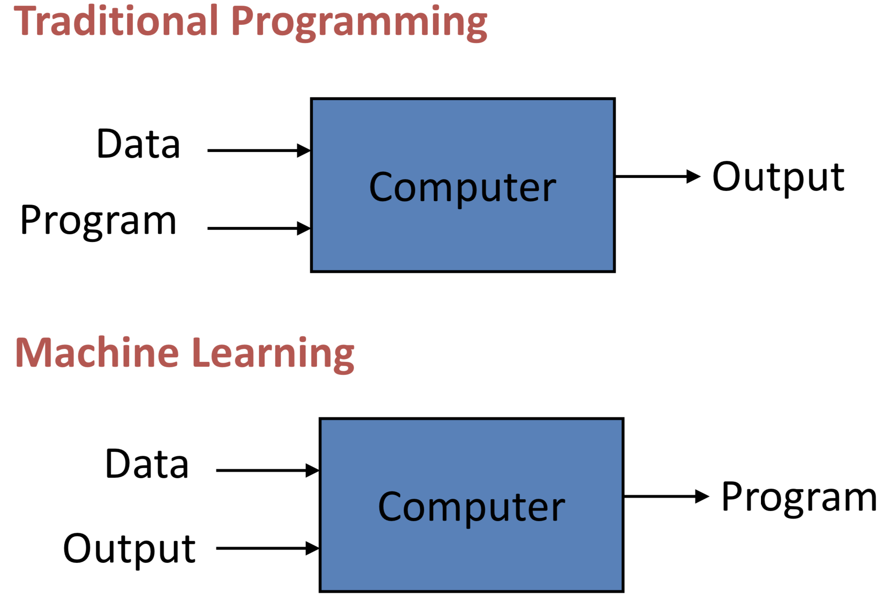

# Machine Learning

> For more details: https://drcs.codes/machine-learning/slides/intro-ml.pdf

A machine learning program is a program that improves its performance on task `T` as measured by performance measure `P` in response to experience `E`.

So a machine learning problem is defined by the three items: task (`T`), performance measure (`P`) and experience (`E`).  For example:

- `T`: Classify tumors as malignant or benign
- `P`: Percentage of correctly classified tumors
- `E`: Database of attributes (a.k.a. “features”) of breast cancer cases (e.g., tumor size and patient age) labelled with malignant or benign

The database of cases is usually called a “training data” set.

One way to think of machine learning programs versus traditional programs is that in traditional programs the programmer writes the logic that transform the program's input to the desired output.  In a machine learning program the programmer chooses an algorithm and appropriate data for the task, and the algorithm (itself implemented in a program) uses the data to "write" a custom program for the task.  Pictorially (read "Data" as "Input"):



Classification is a kind of supervised learning task in which an instance of a phenomenon (in our running example, a person of a particular age with a tumor of a particular size) is classified into one of a fixed number of categories, in this example “malignant” or “benign.”  A classifier is a function whose inputs are query instances and outputs are categories.  A machine learning program uses the data to "learn" an approximation of this function.

“Supervised” just means the learner has training data labelled with answers.  During the training phase, a classifier reads the training data and identifies patterns in the data that it uses to classify other instances.

Let’s make this concrete.  Say we have the following training data (a real-world data set would be much larger, e.g., https://archive.ics.uci.edu/ml/datasets/breast+cancer+wisconsin+(diagnostic)):

```
tumor_size,patient_age,result
1.0cm,22,benign
3.0cm,44,malignant
1.5cm,30,benign
4.2cm,28,malignant
```

The top line is a header.  It tells us what the values in the other rows represent.  For example, the first value is a tumor size from a patient, the second value is the patient’s age, and the third value is the result of a biopsy.  So each row represents a single breast cancer case.  The third value -- result -- is the “answer”, and the fact that our data set includes these answers means that this is a supervised learning problem.

We feed this training data to a classifier -- we “train” the classifier -- and the classifier builds a model that relates tumor size and age to the likelihood of a biopsy returning a malignant diagnosis.  Then we can query the trained model with a new breast cancer case -- represented by a tumor size and patient age -- and the classifier will tell us how likely it is that a biopsy will return a malignant diagnosis.
